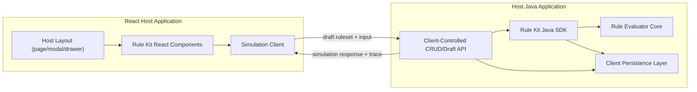

# Rule Kit Detailed Blueprint

Date: 2026-04-20
Status: Historical draft blueprint; superseded by the current Java 17 backend SDK structure
Purpose: Define a concrete front-end and back-end SDK architecture for an embeddable rule-kit, including repo structure, packages, contracts, examples, UI mockups, draft lifecycle, and host-application usage.

> Current-state note, 2026-05-02: this blueprint is retained as research history. The implemented backend SDK now uses `rule-kit-java/rule-kit-core`, `rule-kit-java/rule-kit-sdk`, `rule-kit-java/rule-kit-spring-boot-starter`, `rule-kit-java/rule-kit-sample-app`, and `rule-kit-java/rule-kit-benchmarks`. Core Java packages are split by responsibility: `model`, `evaluation`, `resolver`, `validation`, `trace`, `operator`, `rollout`, and `exception`. Use `../README.md` and `../migration/2026-05-01-dynamic-config-v1-rulekit-native-plan.md` for current guidance.

## 1. Product Intent

The rule-kit should let host applications:

- configure rules through a reusable React component SDK
- evaluate those rules through a reusable Java SDK
- preview and simulate rule results from the frontend using the exact same semantics as backend execution
- store drafts and published revisions without being forced into one storage engine or one app architecture
- embed the UI smoothly inside:
  - an existing page
  - a new page
  - a modal
  - a drawer
  - an inline settings panel

## 2. Non-Negotiable Requirements

1. Rules are ORed across the ruleset.
2. Conditions inside a rule are ANDed.
3. First satisfied rule wins.
4. Response payload can be any JSON value.
5. Operators are type-aware.
6. Frontend preview and simulation must use the exact same evaluation semantics as backend execution.
7. Backend is Java-based.
8. Frontend is mostly React-based.
9. Clients should not feel locked in by the SDK.
10. Drafting, publishing, rollback, fetch, update, and delete must be practical for consuming applications.

## 3. What The SDK Should And Should Not Own

### SDK should own

- canonical rule schema
- type-aware operator registry
- evaluation semantics
- validation rules
- simulation request and response contract
- Java evaluator SDK
- React component SDK
- extensibility points

### SDK should not force

- one persistence engine
- one API shape for all clients
- one hosting model for the UI
- one page layout
- one auth model
- one approval workflow

### Client application should usually own

- persistence of drafts and revisions
- authorization and access control
- audit policy and approver roles
- business-specific field registry and schemas
- exact hosting surface for the UI

## 4. Recommended Architecture In One View



## 5. Core Product Decision

### 5.1 Canonical rule model

We should use our own versioned JSON AST.

Example:

```json
{
  "$schema": "https://cars24.dev/rule-kit/ruleset-v1.json",
  "id": "pricing-rules",
  "revision": 12,
  "executionMode": "FIRST_MATCH",
  "defaultResponse": null,
  "rules": [
    {
      "id": "vip-discount",
      "name": "VIP discount",
      "priority": 100,
      "enabled": true,
      "when": {
        "all": [
          { "fieldRef": "customer.tier", "operator": "EQ", "value": "vip" },
          { "fieldRef": "cart.total", "operator": "GTE", "value": 5000 },
          { "fieldRef": "customer.city", "operator": "IN", "value": ["Delhi", "Gurgaon"] }
        ]
      },
      "then": {
        "response": {
          "discountPercent": 12,
          "label": "VIP discount"
        }
      }
    },
    {
      "id": "standard-discount",
      "name": "Standard discount",
      "priority": 50,
      "enabled": true,
      "when": {
        "all": [
          { "fieldRef": "cart.total", "operator": "GTE", "value": 2000 }
        ]
      },
      "then": {
        "response": {
          "discountPercent": 5,
          "label": "Standard discount"
        }
      }
    }
  ]
}
```

### 5.2 Boolean model

Do **not** expose unrestricted nested AND/OR in v1.

Recommended authoring model:

- top-level rules = OR
- rule conditions = AND
- optional future expert mode = narrowly constrained, not arbitrary trees

Why:

- easier for users
- easier traces
- easier FE/BE parity
- easier replacement of existing systems like Assigno

## 6. Monorepo / Multi-Package Structure

Recommended structure:

```text
rule-kit/
├── docs/
│   ├── research/
│   ├── architecture/
│   └── examples/
│
├── rule-kit-contract/
│   ├── schemas/
│   │   ├── ruleset-v1.json
│   │   ├── field-registry-v1.json
│   │   └── simulation-request-v1.json
│   └── examples/
│
├── rule-kit-java/
│   ├── rule-kit-java-core/
│   ├── rule-kit-java-sdk/
│   ├── rule-kit-java-spring-starter/
│   └── rule-kit-java-testkit/
│
├── rule-kit-react/
│   ├── rule-kit-react-core/
│   ├── rule-kit-react-components/
│   ├── rule-kit-react-presets/
│   └── rule-kit-react-testkit/
│
├── rule-kit-server-example/
│   ├── api/
│   ├── persistence/
│   └── auth/

├── rule-kit-host-reference/
│   ├── java-host-mongo-example/
│   └── java-host-postgres-example/
│
└── rule-kit-demo-app/
    ├── frontend/
    └── backend/
```

## 7. Backend Blueprint

## 7.1 Backend module split

### `rule-kit-java-core`

Owns:

- canonical Java model of the rule AST
- evaluator core
- operator registry contracts
- trace model
- validation

### `rule-kit-java-sdk`

Owns:

- public Java API for host applications
- simulation facade
- evaluation of rulesets supplied by the host application

### `rule-kit-java-spring-starter`

Owns:

- auto-configuration
- Spring beans
- optional MVC helpers

Important boundary:

- the SDK has no database dependency
- the host application owns persistence completely
- reference implementations can live outside the SDK as examples only

## 7.2 Backend package layout

```text
com.cars24.rulekit
├── contract
├── model
├── validation
├── operator
├── evaluator
├── trace
├── sdk
├── simulation
├── starter
└── support
```

## 7.3 Backend class inventory

### Contract and model

| Class / Interface | Responsibility |
|---|---|
| `RuleSet` | Root ruleset aggregate |
| `RuleDefinition` | One ordered rule |
| `ConditionGroup` | AND-only condition list for v1 |
| `ConditionDefinition` | One field/operator/value condition |
| `RuleResponse` | Wrapper around any JSON response |
| `ExecutionMode` | `FIRST_MATCH` for v1 |
| `FieldDefinition` | One known field and its type |
| `FieldRegistry` | Registry of fields available to evaluation |
| `OperatorDefinition` | Operator metadata and operand contract |
| `OperatorRegistry` | Available operators by type |

### Validation

| Class / Interface | Responsibility |
|---|---|
| `RuleSetValidator` | Structural validation of rulesets |
| `ConditionValidator` | Per-condition semantic validation |
| `ResponseValidator` | Validate response payload against optional schema |
| `FieldRegistryValidator` | Validate field registry integrity |
| `ValidationResult` | Warnings and errors |

### Evaluation

| Class / Interface | Responsibility |
|---|---|
| `RuleEvaluator` | Main evaluator interface |
| `DefaultRuleEvaluator` | Ordered first-match evaluator |
| `ConditionEvaluator` | Evaluates one condition |
| `OperatorExecutor` | Executes one operator |
| `EvaluationContext` | Input data plus metadata |
| `EvaluationResult` | Matched rule, response, trace |
| `MatchedRule` | Details of the winning rule |

### Trace and explainability

| Class / Interface | Responsibility |
|---|---|
| `EvaluationTrace` | Full evaluation trace |
| `RuleTrace` | One rule’s evaluation outcome |
| `ConditionTrace` | One condition’s evaluation outcome |
| `TraceLevel` | Compact vs verbose trace modes |

### SDK and simulation

| Class / Interface | Responsibility |
|---|---|
| `RuleKitClient` | Main host-facing SDK facade |
| `RuleSetSource` | Host-supplied source of published rulesets |
| `DraftRuleSetEvaluator` | Evaluates in-memory drafts |
| `SimulationService` | Shared simulation facade used by host APIs |
| `SimulationRequest` | Draft + input + trace settings |
| `SimulationResponse` | Response payload + trace |

### Host integration contracts

| Class / Interface | Responsibility |
|---|---|
| `RuleSetSource` | Host returns the ruleset to evaluate |
| `FieldRegistrySource` | Host returns available field definitions |
| `SimulationAuditSink` | Optional host hook for simulation/evaluation audit |

## 7.4 Backend evaluator behavior

Evaluation algorithm:

1. Validate ruleset if not already validated
2. Sort rules by priority descending
3. For each enabled rule:
   - evaluate all conditions in `when.all`
   - if all are true:
     - return `then.response`
     - include rule/condition trace
4. If no match:
   - return `defaultResponse`

Example evaluation:

Input:

```json
{
  "customer": { "tier": "vip", "city": "Delhi" },
  "cart": { "total": 6200 }
}
```

Output:

```json
{
  "matchedRuleId": "vip-discount",
  "response": {
    "discountPercent": 12,
    "label": "VIP discount"
  }
}
```

## 7.5 Backend simulation model

Since backend is Java and frontend is React, safest v1 path:

- Java evaluator is source of truth
- frontend sends in-memory draft ruleset to simulation endpoint
- backend evaluates with same runtime evaluator

Example request:

```json
{
  "draftRuleSet": { "...": "ruleset json" },
  "input": {
    "customer": { "tier": "vip" },
    "cart": { "total": 6200 }
  },
  "traceMode": "VERBOSE"
}
```

Example response:

```json
{
  "matchedRuleId": "vip-discount",
  "response": {
    "discountPercent": 12
  },
  "trace": {
    "rules": [
      {
        "ruleId": "vip-discount",
        "matched": true,
        "conditions": [
          {
            "fieldRef": "customer.tier",
            "operator": "EQ",
            "expected": "vip",
            "actual": "vip",
            "matched": true
          }
        ]
      }
    ]
  }
}
```

## 7.6 Host-owned persistence reference model

This is a **reference pattern for host applications**, not an SDK-owned storage model.

### Recommended host persistence shape

Current:

- `rule_sets_current`
- `rule_revisions`
- `rule_drafts`
- `rule_audit_events`

### Example current record

```json
{
  "tenantId": "cars24",
  "ruleKey": "pricing-rules",
  "status": "PUBLISHED",
  "schemaVersion": 1,
  "revision": 12,
  "payloadHash": "sha256:abc123",
  "payload": { "...": "canonical ruleset json" }
}
```

### Example draft record

```json
{
  "tenantId": "cars24",
  "ruleKey": "pricing-rules",
  "draftId": "draft-42",
  "baseRevision": 12,
  "status": "DRAFT",
  "payload": { "...": "draft ruleset json" },
  "savedBy": "alice@cars24.com"
}
```

## 7.7 Client-owned backend API pattern

The SDK should not force one CRUD API, but we should recommend one.

### Recommended host API surface

| Method | Endpoint | Purpose |
|---|---|---|
| `GET` | `/rule-sets/{ruleKey}` | Get current published ruleset |
| `GET` | `/rule-sets/{ruleKey}/revisions` | Get revision history |
| `GET` | `/rule-sets/{ruleKey}/drafts/{draftId}` | Load a draft |
| `POST` | `/rule-sets/{ruleKey}/drafts` | Create a draft from current |
| `PUT` | `/rule-sets/{ruleKey}/drafts/{draftId}` | Save draft changes |
| `DELETE` | `/rule-sets/{ruleKey}/drafts/{draftId}` | Delete draft |
| `POST` | `/rule-sets/{ruleKey}/simulate` | Simulate with current or draft |
| `POST` | `/rule-sets/{ruleKey}/publish` | Publish a draft as a revision |
| `POST` | `/rule-sets/{ruleKey}/rollback` | Roll back to a prior revision |

### Important point

These endpoints belong to the **client application**, not necessarily to the SDK.

The SDK should help the client implement them, not force them.

## 7.8 Example host application usage in Java

### Example service

```java
@Service
public class PricingDecisionService {

    private final RuleKitClient ruleKitClient;

    public PricingDecisionService(RuleKitClient ruleKitClient) {
        this.ruleKitClient = ruleKitClient;
    }

    public JsonNode evaluatePricing(PricingInput input) {
        EvaluationContext context = EvaluationContext.fromObject(input);
        EvaluationResult result = ruleKitClient.evaluatePublished("pricing-rules", context);
        return result.response();
    }
}
```

### Example simulation endpoint

```java
@RestController
@RequestMapping("/rule-sets/{ruleKey}")
public class RuleSimulationController {

    private final SimulationService simulationService;

    @PostMapping("/simulate")
    public SimulationResponse simulate(
            @PathVariable String ruleKey,
            @RequestBody SimulationRequest request) {
        return simulationService.simulate(ruleKey, request);
    }
}
```

## 8. Frontend Blueprint

## 8.1 Frontend module split

### `rule-kit-react-core`

Owns:

- editor state
- validation adapters
- simulation client
- field/operator registry wiring

### `rule-kit-react-components`

Owns:

- reusable visual components

### `rule-kit-react-presets`

Owns:

- page, modal, drawer wrappers

## 8.2 Frontend package layout

```text
@cars24/rule-kit-react-core
├── hooks/
├── state/
├── api/
├── validation/
└── types/

@cars24/rule-kit-react-components
├── RuleList/
├── RuleEditor/
├── ConditionRow/
├── ResponseEditor/
├── SimulationPanel/
├── TracePanel/
└── shared/

@cars24/rule-kit-react-presets
├── RuleKitModal/
├── RuleKitDrawer/
└── RuleKitPage/
```

## 8.3 Frontend component inventory

| Component | Responsibility |
|---|---|
| `RuleList` | List, reorder, enable/disable rules |
| `RuleEditor` | Full edit surface for one rule |
| `ConditionList` | Render all conditions in a rule |
| `ConditionRow` | Edit one field/operator/value |
| `ResponseEditor` | Edit response JSON or typed response |
| `SimulationPanel` | Trigger and display simulation |
| `TracePanel` | Show matched rule and trace |
| `RuleSetHeader` | Title, revision, draft state, save/publish actions |
| `ValidationSummary` | Top-level errors/warnings |

## 8.4 Frontend hooks inventory

| Hook | Responsibility |
|---|---|
| `useRuleSetEditor` | Manage local draft state |
| `useRuleValidation` | Validate ruleset and return errors |
| `useRuleSimulation` | Call client simulation endpoint |
| `useFieldRegistry` | Consume host-provided field definitions |
| `useRuleDraftPersistence` | Optional adapter hook for draft save/load |

## 8.5 UI mockups

### Full page editor

```text
┌─────────────────────────────────────────────────────────────────────────────┐
│ Rule Set: pricing-rules                      Draft r12 -> Unsaved changes  │
│ [Save Draft] [Run Simulation] [Publish] [History]                          │
├───────────────────────────────┬─────────────────────────────────────────────┤
│ Rules                         │ Rule Editor                                 │
│ ┌───────────────────────────┐ │ Name: VIP discount                          │
│ │ 1. VIP discount          │ │ Priority: 100   Enabled: [x]                │
│ │ 2. Standard discount     │ │                                             │
│ │ 3. Festival discount     │ │ Conditions (AND)                            │
│ └───────────────────────────┘ │ 1. customer.tier  EQ   vip                  │
│ [Add Rule]                    │ 2. cart.total     GTE  5000                 │
│                               │ 3. customer.city   IN   Delhi,Gurgaon       │
│                               │ [Add Condition]                             │
│                               │                                             │
│                               │ Response                                    │
│                               │ { "discountPercent": 12 }                   │
├───────────────────────────────┴─────────────────────────────────────────────┤
│ Simulation                                                             │
│ Input: { customer: ..., cart: ... }                                   │
│ Result: matched vip-discount                                          │
│ Trace: rule 1 matched, rule 2 not evaluated                           │
└─────────────────────────────────────────────────────────────────────────────┘
```

### Modal editor

```text
┌────────────────────────────────────────────────────────────┐
│ Edit pricing-rules                                  [x]   │
├────────────────────────────────────────────────────────────┤
│ Rule list | Editor | Simulation                           │
│                                                            │
│ [Save Draft] [Run Simulation] [Publish]                    │
└────────────────────────────────────────────────────────────┘
```

### Inline existing page view

```text
Config Details Page

Current Config Summary
- Rule Set: pricing-rules
- Published Revision: r12
- Active Rules: 3

Embedded Rule Kit Section
[Edit Rules]
[Run Simulation]
[View History]
```

## 8.6 Frontend design/customization API

To avoid restriction for host apps, components should support:

- host-provided class names
- component overrides
- controlled props
- theme token mapping
- no forced global layout

Example:

```tsx
<RuleEditor
  value={draftRuleSet}
  fieldRegistry={fieldRegistry}
  onChange={setDraftRuleSet}
  onSimulate={simulateDraft}
  components={{
    ResponseEditor: MyMonacoResponseEditor,
    ConditionValueInput: MyDesignSystemInput,
  }}
  classNames={{
    root: "rounded-2xl border bg-surface",
    toolbar: "sticky top-0 bg-surface/95",
  }}
/>
```

## 8.7 Example host application usage in React

### Existing page

```tsx
export function PricingRulesPage() {
  const [draftRuleSet, setDraftRuleSet] = useState(initialDraft);

  return (
    <RuleKitPage
      value={draftRuleSet}
      fieldRegistry={fieldRegistry}
      onChange={setDraftRuleSet}
      onSimulate={simulateDraft}
      onSaveDraft={saveDraft}
      onPublish={publishDraft}
    />
  );
}
```

### Modal

```tsx
export function EditRulesModal({ open, onOpenChange }: Props) {
  return (
    <Dialog open={open} onOpenChange={onOpenChange}>
      <DialogContent className="max-w-6xl">
        <RuleKitModal
          value={draftRuleSet}
          fieldRegistry={fieldRegistry}
          onChange={setDraftRuleSet}
          onSimulate={simulateDraft}
          onSaveDraft={saveDraft}
        />
      </DialogContent>
    </Dialog>
  );
}
```

## 9. FE <-> BE Interaction Contract

## 9.1 Field registry

The backend or host application should expose a field registry to the frontend.

Example:

```json
{
  "fields": [
    {
      "name": "customer.tier",
      "type": "string",
      "label": "Customer Tier",
      "allowedOperators": ["EQ", "IN", "NOT_IN", "EXISTS", "NOT_EXISTS"]
    },
    {
      "name": "cart.total",
      "type": "number",
      "label": "Cart Total",
      "allowedOperators": ["EQ", "GT", "GTE", "LT", "LTE", "BETWEEN"]
    }
  ]
}
```

## 9.2 Simulation

Frontend sends:

- in-memory draft ruleset
- sample input
- desired trace mode

Backend returns:

- matched rule
- response payload
- validation issues
- evaluation trace

## 9.3 Draft persistence

Frontend should not need to know MongoDB or PostgreSQL specifics.

Frontend only needs host-provided functions like:

- `loadDraft(ruleKey, draftId)`
- `saveDraft(ruleKey, draft)`
- `deleteDraft(ruleKey, draftId)`
- `publishDraft(ruleKey, draftId)`
- `getRevisionHistory(ruleKey)`

## 10. How A Client Replaces Assigno Logic With Rule-Kit

We should not follow Assigno wholesale.

But we should be able to replace specific slices.

### Replace derived-field rules

Current Assigno pattern:

- `RuleEvaluationService` enriches task or user metadata

Future rule-kit pattern:

- host converts task into `EvaluationContext`
- `RuleKitClient.evaluatePublished("task-derived-fields", context)`
- host merges returned JSON into task metadata

### Replace group resolution

Current Assigno pattern:

- `GroupResolverService` picks first matching group

Future rule-kit pattern:

- host evaluates `group-routing-rules`
- response payload returns:
  - group ID
  - group name
  - routing metadata

### Keep untouched

- OptaPlanner solver
- auth
- callbacks
- analytics
- ingestion queues

## 11. Extensibility Model

## 11.1 Operator extensions

Clients should be able to add new operators.

Example:

- `IS_WEEKEND`
- `HAS_TAG`
- `WITHIN_RADIUS`

Recommended shape:

- custom operator registration in Java
- matching operator metadata in frontend field/operator registry

## 11.2 Field extensions

Clients should be able to expose arbitrary domain fields to the UI/evaluator:

- `lead.score`
- `user.capacity`
- `customer.lastPurchaseAt`

## 11.3 Response extensions

Clients should be able to:

- keep any JSON response
- optionally validate it against a client-specific schema

## 12. Drafts, Publishing, And Rollback

## 12.1 Recommended lifecycle

1. Create draft from published revision
2. Save draft many times
3. Run simulation against draft
4. Publish draft into immutable revision
5. Current pointer changes to the new revision
6. Rollback means changing current pointer to an earlier immutable revision

## 12.2 Responsibility split

### SDK responsibility

- validate draft payload
- simulate draft
- evaluate published revision

### Client responsibility

- store drafts
- enforce permissions
- approve publish
- track who changed what
- decide how rollback is authorized

## 13. Why This Blueprint Is Better Than Copying Internal Systems

### Better than copying Assigno

- avoids unrestricted nested boolean trees
- avoids solver-coupled architecture
- still borrows its typed builder patterns

### Better than copying dynamic-config

- avoids feature-flag-specific rollout semantics as the core model
- still borrows its shared evaluator-core discipline and packaging

## 14. Recommended Build Order

1. Define canonical AST + JSON schema
2. Build Java evaluator core
3. Build Java SDK + Spring starter
4. Build simulation endpoint contract
5. Build React core hooks and components
6. Build modal/page/drawer presets
7. Write host reference implementations for Mongo and Postgres persistence
8. Add draft/publish/rollback reference implementation

## 15. Final Recommendation

### Backend

- Java evaluator core as source of truth
- Java SDK for host apps
- Spring starter for smooth integration
- no database dependency inside the SDK
- host-owned persistence with reference implementations and examples

### Frontend

- React component SDK first
- component-level embedding, not fixed app shell
- host-owned layout and styling
- backend-driven simulation in v1 for exact semantic parity

### Product model

- OR across rules
- AND inside each rule
- first match wins
- no arbitrary nested AND/OR in v1

This is the most usable, most replaceable, and least restrictive shape for the rule-kit you described.
